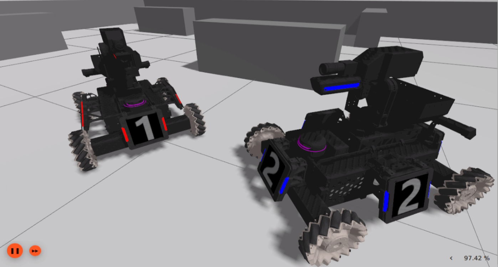
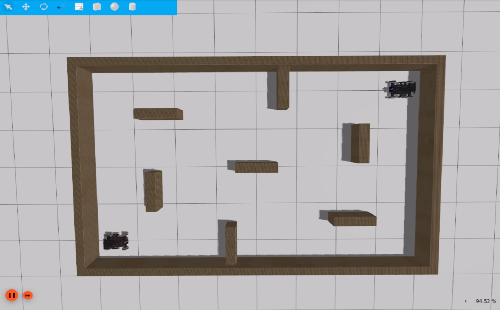

# rmua19_gazebo_simulator

### 1. Introduction

rmua19_gazebo_simulator is a simulation environment based on Gazebo (Ignition alphabetical version) for the development of robotics algorithms in RoboMaster University AI Challenge 2019, to facilitate testing of AI algorithms and speed up development efficiency.



The rmua19_gazebo_simulator is not yet complete and only offers the following features.

Adding relevant sensors to the rmua19 standard robot (rmua19_standard_robot) and building different robot models:
  * rmua19_standard_robot_a: with gimbal camera industrial_camera and with LIDAR rplidar_a2, where the camera is placed on the yaw axis.
  * rmua19_standard_robot_b: with gimbal camera industrial_camera and LIDAR rplidar_a2, where the camera is placed on the pitch axis.

Building the RoboMaster University AI Challenge 2019 simple field (models/rmua19_battlefield):
  * Only the fence

> RoboMaster University AI Challenge 2019 standard robot robot model (rmua19_standard_robot) located at [rmoss_gz_resources](https://github.com/robomaster-oss/rmoss_gz_resources)
>
> Note: [Gazebo (Ignition alphabetical version)](https://github.com/gazebosim/gz-sim) is still in rapid development and the emulation is not perfect and may be buggy.

### 2. Basic use

**Environment configuration**

* ROS2 version requirement: `Humble` (currently in development, based on the latest version of ROS2)
* Gazebo emulator version requirements: `` Fortress`` (new version of Gazebo is currently in development)

```bash
# install gazebo dependencies
sudo apt-get install ignition-fortress libignition-cmake2-dev ros-humble-ros-gz
# install xmacro (xml macro tool for sdf)
pip install xmacro
# added by @marcopra
pip install empy
pip install lark
# cd src directory of ros2 workspace 
git clone https://github.com/robomaster-oss/rmoss_interfaces -b humble
git clone https://github.com/robomaster-oss/rmoss_core -b humble
git clone https://github.com/robomaster-oss/rmoss_gazebo -b humble
git clone https://github.com/robomaster-oss/rmoss_gz_resources -b humble --depth=1
git clone https://github.com/robomaster-oss/rmua19_gazebo_simulator -b humble
# cd ros2 workspaces
cd ..
rosdep install -y -r -q --from-paths src --ignore-src --rosdistro humble
# cd ros2 workspace
colcon build

# Source this workspace setup.bash path
source ~/<this_workspace_path>/install/setup.bash
```

**starting the simulation environment**

```bash
# ros2 launch rmua19_gazebo_simulator standard_robot_a_test.launch.py 
ros2 launch rmua19_gazebo_simulator standard_robot_b_test.launch.py 
```

* Note: You need to click the orange ``launch`` button on the Gazebo interface

**Control robot movement**

```bash
ros2 run rmoss_gz_base test_chassis_cmd.py --ros-args -r __ns:=/red_standard_robot1/robot_base -p v:=0.3 -p w:=0.3
#Type as prompted, supports translation and spin
```

* The base plate is controlled using the mecanum plugin

**Control robot gimbal**

```bash
ros2 run rmoss_gz_base test_gimbal_cmd.py --ros-args -r __ns:=/red_standard_robot1/robot_base
# Enter as prompted, absolute angle control supported
```

* The head uses position PID control

**robot shooting**

```bash
ros2 run rmoss_gz_base test_shoot_cmd.py --ros-args -r __ns:=/red_standard_robot1/robot_base
#Type as prompted
```

* The shooting function is based on the plugin `ProjectileShooter` in `rmoss_gz`.
* **Note: There is currently an unresolved bug (in some cases it can make the physics engine wrong and cause Gazebo to crash)**

### 3. Easy Race Mode 1v1

* Please use caution as there are known bugs in the shooting function and possibly other unknown bugs in the current testing.

**Run the Gazebo emulator**

```bash
ros2 launch rmua19_gazebo_simulator simple_competition_1v1.launch.py 
```



**Running the referee system**

```bash
ros2 run rmua19_gazebo_simulator simple_competition_1v1_referee.py 
```

* Projectile damage is 10 and each robot has 500 HP until HP is 0. The referee system outputs the winner and the program exits. (can be re-run to start)
* Referee function by parsing and processing attack information `/referee_system/attack_info` (including shooter information as well as hit target information).

**Controlbot-ROS2 interface**

For example, for red_standard_robot1, the following ROS2 topic interface is used for robot control and awareness. (same for standard_robot_blue1)

```bash
/red_standard_robot1/robot_base/chassis_cmd
/red_standard_robot1/robot_base/gimbal_state
/red_standard_robot1/robot_base/odom
/red_standard_robot1/robot_base/shoot_cmd
/red_standard_robot1/front_camera/image
/red_standard_robot1/rplidar_a2/scan
```

### 4. Maintainer and open source license

Maintainer: Zhenpeng Ge, zhenpeng.ge@qq.com

rmua19_gazebo_simulator is provided under the Apache License 2.0.

